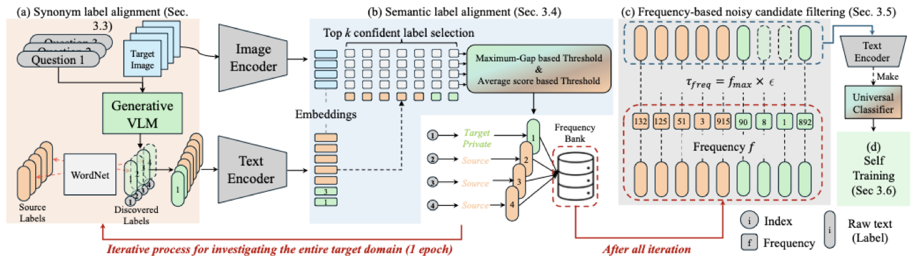

# TLSA: Training-free Label Space Alignment for Universal Domain Adaptation

Official implementation of **"Training-free Label Space Alignment for Universal
Domain Adaptation"**, Engineering Applications of Artificial Intelligence 181
(2026) 115558.

[Paper](https://doi.org/10.1016/j.engappai.2026.115558) ·
[arXiv](https://arxiv.org/abs/2509.17452)

Dujin Lee, Sojung An, Jungmyung Wi, Kuniaki Saito, Donghyun Kim



Universal domain adaptation (UniDA) has to cope with a target domain whose label
space is unknown: some classes are shared with the source domain, others are
private to the target. Prior work aligns the two domains in *visual* space,
where domain shift makes the decision ambiguous. TLSA instead aligns the two
**label spaces**, using a generative VLM to discover a label for every target
image and then filtering those labels in three training-free steps:

| Step | What it removes | Where |
| --- | --- | --- |
| 1. Synonym label alignment | lexical synonyms of source classes (WordNet) | `methods/alignment.py::synonym_alignment` |
| 2. Semantic label alignment | semantically ambiguous labels, via instance-adaptive thresholds in CLIP's joint embedding space | `methods/alignment.py::prediction_set_mask` |
| 3. Frequency-based filtering | rare, noisy candidates (`tau_freq = epsilon * max(F)`) | `methods/alignment.py::frequency_threshold` |

The surviving labels extend the source label set into a **universal
classifier**. A second stage (**TLSA+ST**) adapts the frozen CLIP backbone with
reliable pseudo-labels selected by balanced top-k confidence and an EMA teacher.

Steps 1–3 need a single pass over the target domain and take no gradient step.

## Installation

```bash
conda create -n tlsa python=3.10 -y
conda activate tlsa
pip install -r requirements.txt
python -c "import nltk; nltk.download('wordnet'); nltk.download('omw-1.4')"
```

> **Do not `pip install clip`.** This repository ships a modified copy of
> OpenAI CLIP under [`clip/`](clip/) that adds AdaptFormer adapters to the
> vision transformer (`clip.load(..., tuning_config=...)`). `main.py` puts the
> repository root first on `sys.path`, so the bundled package shadows any copy
> installed in `site-packages` — cloning the repository is all that is needed.

## Data preparation

Download Office31, Office-Home, VisDA and DomainNet and lay them out as
described in [`datasets/DATASET.md`](datasets/DATASET.md), then point
`--data_dir` at the root (default `./data`).

The class splits follow the standard UniDA protocol and are passed as
`--n_share` / `--n_source_private`:

| Dataset | open-partial | open | closed | partial |
| --- | --- | --- | --- | --- |
| Office31 | 10 / 10 | 10 / 0 | 31 / 0 | 10 / 21 |
| Office-Home | 10 / 5 | 15 / 0 | 65 / 0 | 25 / 40 |
| VisDA | 6 / 3 | 6 / 0 | 12 / 0 | 6 / 6 |
| DomainNet | 150 / 50 | 150 / 0 | 345 / 0 | 150 / 195 |

## Usage

### Stage 1 — training-free label space alignment

```bash
python main.py --method TLSA \
    --dataset office31 --source_domain amazon --target_domain dslr \
    --n_share 10 --n_source_private 10 \
    --backbone ViT-B/16 --batch_size 128
```

This writes `alignment.json` (the discovered label space) next to the
evaluation results, and reports H-score / H³-score directly.

### Stage 2 — self-training (TLSA+ST)

```bash
python main.py --method TLSA_ST \
    --dataset office31 --source_domain amazon --target_domain dslr \
    --n_share 10 --n_source_private 10 \
    --backbone ViT-B/16 --batch_size 64 --base_lr 0.01 \
    --max_iter 2500 --ffn_adapt --ffn_num 64
```

The label space is read from the matching Stage 1 run; pass
`--alignment_result <path>` to use a different one.

### Reproducing all benchmarks

```bash
bash scripts/run_tlsa.sh                 # stage 1, all four benchmarks
bash scripts/run_tlsa_st.sh              # stage 2, all four benchmarks
```

Both scripts accept a benchmark name (`office31`, `officehome`, `visda`,
`domainnet`) and read `BACKBONE`, `BATCH_SIZE`, `SEED` from the environment.

## Generative VLM backends

`--vlm blip` (default) runs BLIP-VQA (`blip_vqa`/`vqav2`) through LAVIS and is
the configuration used for the results in the paper.

`--vlm qwen` sends the same prompts to any OpenAI-compatible endpoint, which is
how the Qwen3-VL robustness study was run:

```bash
vllm serve Qwen/Qwen3-VL-2B-Instruct --port 8000
python main.py --method TLSA --vlm qwen \
    --vllm_api_url http://localhost:8000/v1 \
    --vllm_model_name Qwen/Qwen3-VL-2B-Instruct \
    --dataset office31 --source_domain amazon --target_domain dslr \
    --n_share 10 --n_source_private 10
```

`VLLM_API_URL` and `VLLM_MODEL_NAME` are honoured as defaults.

## Method arguments

Every knob of the paper is a command-line argument; the defaults are the
configuration reported in the paper.

| Argument | Default | Meaning |
| --- | --- | --- |
| `--vlm` | `blip` | generative VLM used for label discovery (`blip`, `qwen`) |
| `--num_prompts` | `5` | size of the question ensemble (majority vote over the answers) |
| `--prompt_set` | `default` | `alt` uses the disjoint rephrased prompt set |
| `--topk` | `5` | candidates considered by semantic label alignment |
| `--fusion` | `min` | how `tau_gap` and `tau_avg` combine: `min` (either), `max` (both), `gap`, `avg` |
| `--epsilon` | `0.01` | scaling factor of the frequency threshold |
| `--freq_stat` | `max` | reference statistic of the frequency bank |
| `--no_wordnet` | off | skip Step 1 (synonym label alignment) |
| `--ema_momentum` | `0.98` | EMA teacher momentum (Stage 2) |
| `--ffn_adapt`, `--ffn_num` | off, `64` | AdaptFormer adapters (Stage 2) |
| `--log_imbalance` | off | log the pseudo-label imbalance ratio before/after balanced top-k |

## Output layout

One run, one directory — nothing is encoded in file names:

```
output/runs/<dataset>/<method>/<source>_to_<target>/
    share<n_share>_source_private<n_source_private>/<backbone>/seed<seed>/
        alignment.json    discovered label space (stage 1)
        results.json      H-score, H3-score, accuracies
        config.json       the full configuration of the run
        scores.pth        logits, OOD scores and predictions on the test set
        checkpoint.pth    model weights (--save_checkpoint)
```

Change the root with `--result_dir`.

## Results

H-score (%) of the training-free stage with a CLIP ViT-B/16 backbone and
BLIP-VQA label discovery, averaged over the domain pairs of each benchmark:

| Dataset | OPDA | ODA | PDA | CDA | Avg |
| --- | --- | --- | --- | --- | --- |
| Office31 | 89.9 | 92.6 | 96.1 | 80.5 | 89.8 |
| Office-Home | 91.3 | 89.2 | 82.0 | 79.0 | 85.4 |
| VisDA | 86.3 | 83.9 | 81.8 | 72.6 | 81.1 |
| DomainNet | 75.4 | 76.9 | 70.1 | 68.9 | 72.8 |

In the PDA and CDA settings, where no target-private instances exist, the
average class accuracy is reported in place of the H-score. Self-training
(TLSA+ST) adds a further +1.6 H-score and +2.7 H³-score on average.

## Repository layout

```
clip/          bundled CLIP with AdaptFormer adapters
configs/       argument parser and default paths
datasets/      Office31 / Office-Home / VisDA / DomainNet splits
engine/        trainer, evaluator, dataloaders, optimizer, scheduler
methods/
    base.py        shared backbone/classifier/checkpoint plumbing
    tlsa.py        Stage 1: training-free label space alignment
    tlsa_st.py     Stage 2: self-training with the universal classifier
    alignment.py   the three filtering steps and the text encoders
    vlm.py         BLIP-VQA and OpenAI-compatible label generators
models/        backbones and classifier heads
templates/     CLIP prompt ensembles and the VQA question sets
```

## Acknowledgements

The framework, the baselines and the evaluation protocol build on
[uniood](https://github.com/szubing/uniood) (Deng and Jia, *Universal Domain
Adaptation from Foundation Models: A Baseline Study*). The CLIP prompt
ensembles come from
[cross_modal_adaptation](https://github.com/linzhiqiu/cross_modal_adaptation),
the OSCR evaluation code from
[osr_closed_set_all_you_need](https://github.com/sgvaze/osr_closed_set_all_you_need),
and the adapters follow
[AdaptFormer](https://github.com/ShoufaChen/AdaptFormer).

## Citation

```bibtex
@article{Lee2026TrainingFree,
  title     = {Training-free label space alignment for universal domain adaptation},
  author    = {Lee, Dujin and An, Sojung and Wi, Jungmyung and Saito, Kuniaki and Kim, Donghyun},
  journal   = {Engineering Applications of Artificial Intelligence},
  volume    = {181},
  pages     = {115558},
  year      = {2026},
  issn      = {0952-1976},
  doi       = {10.1016/j.engappai.2026.115558},
  publisher = {Elsevier}
}
```
